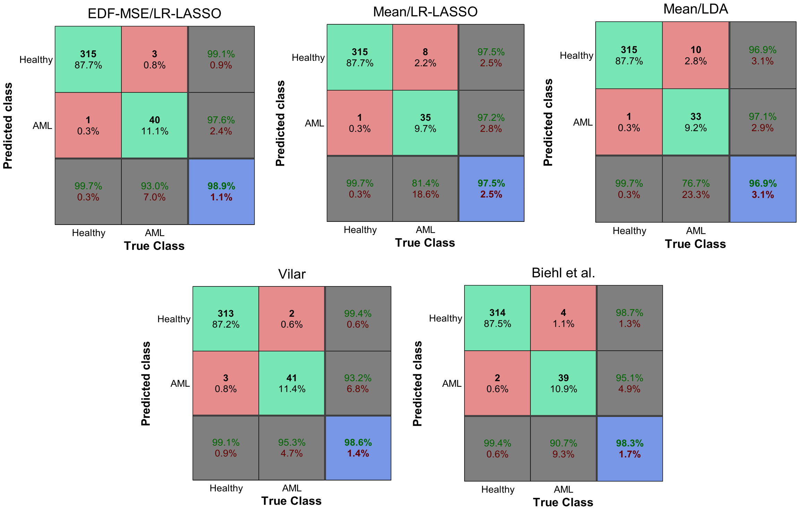

## 1. Assiment 1 

In HW 1, we are responsible to review our classmate's Citibike project proposal, to verify it their Null and alternative hypotheses are formulated correctly and if the data was properly pre-processed to answer the question, and to suggest an appropriate test to test H0 given the type of data.

The peer repository assigned to me is pmb434. I have forked the repository, created a CitibikeReview markdown file, and requested a pull o the original repository to share the markdown (Worked alone).

[CitibikeReview_pmb434.md](https://github.com/xiaoninh/PUI2018_pmb434/blob/master/HW4_pmb434/CitibikeReview_pmb434.md) 

## 2. Assiment 2

In HW 2, we are required to choose three tests from a table, find a paper that uses the test,  and then write out the number of DV, type of DV, number of IV, type of IV, number of control variables, kind of questions as a table in this README.md file.

I worked in a group of three, with MingYi He(mh5172) and Chang Du(cd2682). Each of us was in charge of one test and then we shared and discussed the results with each other. 

The result tables are as follows: 

| **Statistical Analyses**	|  **IV(s)**  |  **IV type(s)** |  **DV(s)**  |  **DV type(s)**  |  **Control Var** | **Control Var type**  | **Question to be answered** | **_H0_** | **alpha** | **link to paper**| 
|:----------:|:----------|:------------|:-------------|:-------------|:------------|:------------- |:------------------|:----:|:-------:|:-------|
ANCOVA	| 4, gender, proportion of intimate partners,length of time knowning their partners,levels of support from parters  |  categorical  | 1, Pain sensitivity rating| ordinal | 1, age | continuous | 	how individuals’ social networks moderate the association between biological sex and experimental pain sensitivity. | Difference between F_pain and M_pain ( when more partners, longer relationship and higher support) = Difference between F_pain and M_pain(when fewer partners, shorter relationship and lower support)  | 0.05 | [Sex Differences in How Social Networks and Relationship Quality Influence Experimental Pain Sensitivity](https://journals.plos.org/plosone/article?id=10.1371/journal.pone.0078663) |
  |||||||||
  
  
The main plots of the paper (the plots that summarized the result)
  

| **Statistical Analyses**	|  **IV(s)**  |  **IV type(s)** |  **DV(s)**  |  **DV type(s)**  |  **Control Var** | **Control Var type**  | **Question to be answered** | **_H0_** | **alpha** | **link to paper**| 
|:----------:|:----------|:------------|:-------------|:-------------|:------------|:------------- |:------------------|:----:|:-------:|:-------|
Correlation | 7, age, gender, self-reported honesty, self-reported popularity, self-reported intelligence, class level, block | categorical | 1, cheating behaviors | ordinal | 1, test difficulty | ordinal | How strongly and in what direction are demographics (age, gender), self-perception(self-reported honesty, self-reported popularity, self-reported intelligence), environmental factors(class level, block) related with cheating behavior. | Depends on which IV is tested: take gender for example: (women's score of experimental group/ women's score of control group) > (men's score of experimental group/ men's score of control group) | 0.05 | [Behavioral correlates of cheating: Environmental specificity and reward expectation](https://journals.plos.org/plosone/article?id=10.1371/journal.pone.0186054) |

The main results of the paper

| **Statistical Analyses**  |  **IV(s)**  |  **IV type(s)** |  **DV(s)**  |  **DV type(s)**  |  **Control Var** | **Control Var type**  | **Question to be answered** | **_H0_** | **alpha** | **link to paper**| 
|:----------:|:----------|:------------|:-------------|:-------------|:------------|:------------- |:------------------|:----:|:-------:|:-------|
Logistic Regression | 7, Number of tubes | categorical | 84, combination of features | continuous | 5, fluorescence markers | categorical | How flow cytometry measurements from a single patient and gives a confidence score of the patient being AML-positive.| patient being AML-positive | 0.05 | [Leukemia Prediction Using Sparse Logistic Regression](https://journals.plos.org/plosone/article?id=10.1371/journal.pone.0072932)

The main plots of the paper (the plots that summarized the result)
  

## 3. Assiment 3

In HW 3, we are responsible to reproduce the analysis of the Hard to Employ programs for NY. I stated null hypothesis for the "Convicted of a felony after 3 years" data, completed both Z and chi-sq tests, and stated the results in term of the null hypothesis for all tests. Worked Alone. 

[effectivenes of NYC Post-Prison Employment Programs](https://github.com/xiaoninh/PUI2018_xh1163/blob/master/HW5_xh1163/effectivenes%20of%20NYC%20Post-Prison%20Employment%20Programs.ipynb) 

## 4. Assiment 4

In HW 4, we are reqireed to test if the distribution of trip duration of bikers that ride during the day vs night are different, by using 3 tests: KS, Pearson's, Spearman's, and stated the results in term of the null hypothesis for all tests.
Worked Alone. 

[citibikes_compare_distributions (Day vs. Night)](https://github.com/xiaoninh/PUI2018_xh1163/blob/master/HW5_xh1163/citibikes_compare_distributions%20(Day%20vs.%20Night).ipynb) 

I also completed the original skeleton notebook for[citibikes_compare_distributions (Age & Gender)](https://github.com/xiaoninh/PUI2018_xh1163/blob/master/HW5_xh1163/citibikes_compare_distributions%20%20(Age%20%26%20Gender)_%20finished%20origin%20notebook.ipynb)
